# Como editar o site pelo GitHub

Para editar o site, é necessário ter se logado e que sua conta tenha
acesso para fazer edição.

## Trocando lugar onde serão feitas as alterações

Na primeira página existe um botão escrito `Branch:`. Clique nele e
troque a branch para `staging`, que é onde alterações devem ser feitas
em primeiro momento.

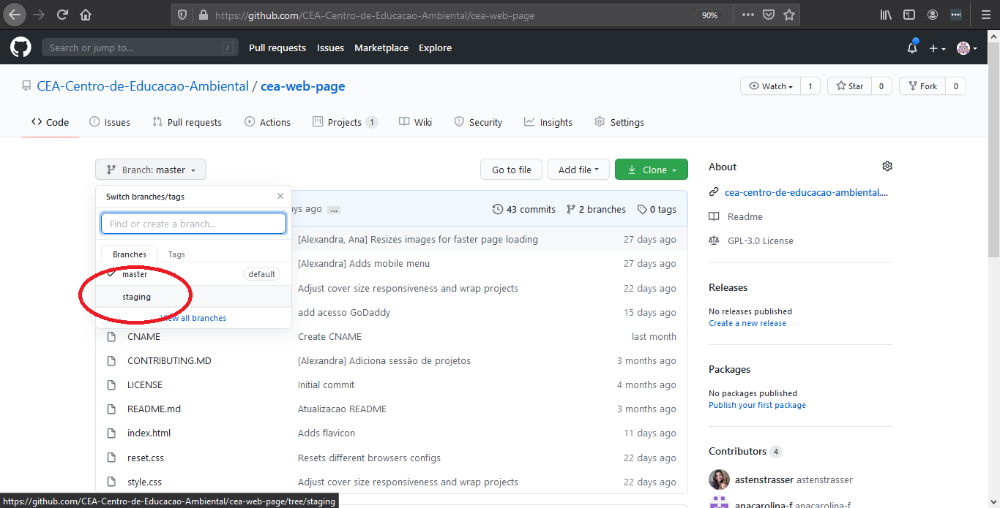

Isso serve para que as correções não entrem direto no site que está
público para as pessoas consultarem, para poder ver o resultado e ter
certeza que é isso mesmo que se quer subir.

Alterações feitas assim sobem no [site de staging].

## Fazendo a edição de arquivos de texto

Depois de trocar para staging, clique no arquivo que deseja editar. Em
seguida, clique no lápis no canto superior direito do conteúdo do
arquivo para iniciar a edição.

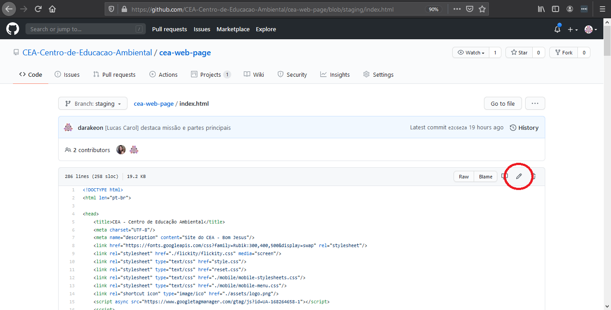

Depois que terminar de editar, desça até o final da tela. Lá, haverá
duas caixas de texto. A primeira serve para colocar um resumo curto
do que foi feito, algo até 50 caracteres (letras, pontuação, números e
espaços). Se tiver alguma explicação mais complexa sobre o que alterou,
a segunda caixa serve para isso - e pode ser deixada em branco, caso
não seja necessária.

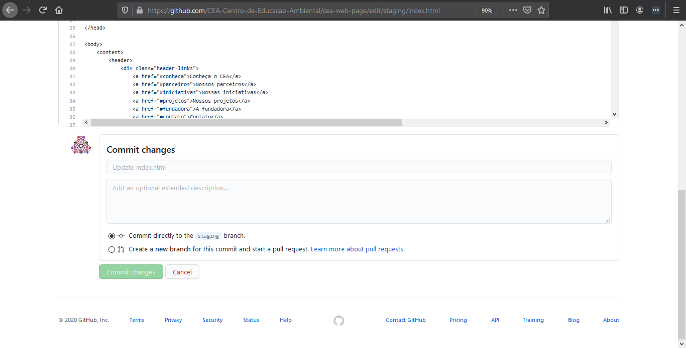

Depois que a mensagem da alteração estiver pronta, deixe selecionado
"Commit directly to the `staging` branch". Então clique no botão abaixo
das caixas, "Commit changes".

Aguarde algum tempo e a alteração estará no [site de staging]. É
possível fazer quantas alterações forem necessárias.

## Arquivos de imagens

Para os arquivos de imagens não é possível editar direto no site do
github. Mas é possível subir e excluir imagens criadas e editadas no
computador.

### Subindo novas imagens

Para colocar novas imagens no github, troque para `staging`, como
mencionado no começo desde tutorial. Então clique em "Add file", em
seguida em "Upload files".

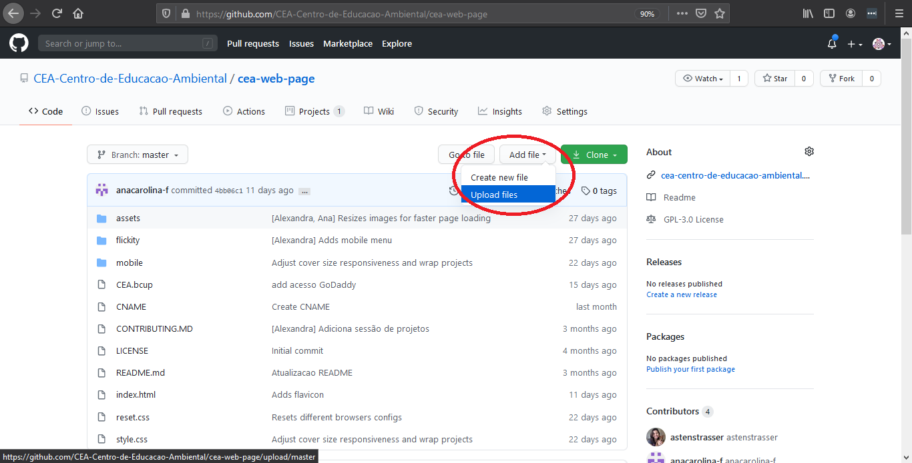

Você poderá arrastar a imagem do seu computador para a caixa onde se lê
"Drag files here to add them to your repository" ou mesmo clicar em
"choose your files", que irá abrir uma janela para que você selecione a
imagem no seu computador.

No final da página, existem duas caixas de mensagem. São as mesmas duas
que estão na edição do arquivo, funcionam da mesma forma.

Caso queira subir uma imagem em uma pasta específica, antes de clicar
em "Add files", você deve clicar na pasta onde quer subir os arquivos.
Por exemplo, no momento os arquivos de imagens do site estão
organizados em subpastas dentro da pasta `assets`.

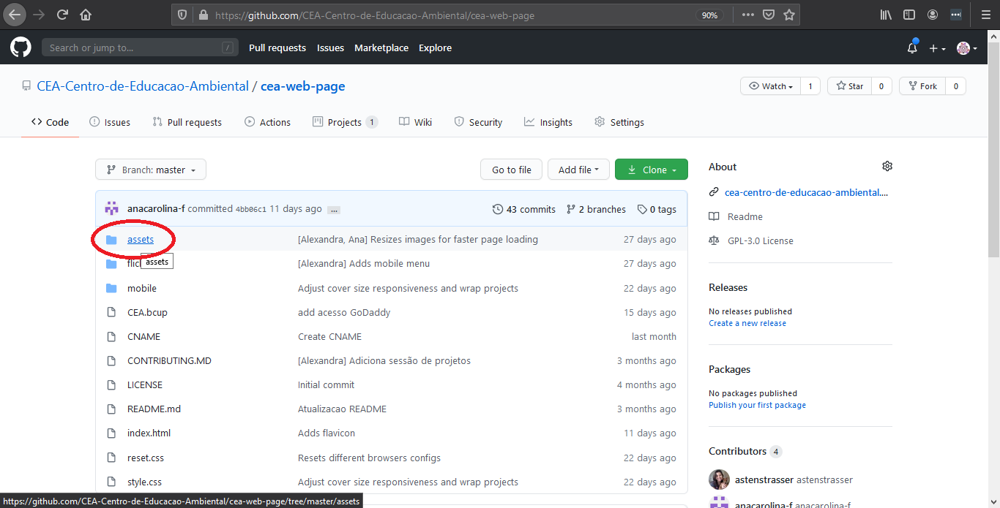

Ao clicar, o botão de "Add file" estará apenas um pouco mais a direita.
O passo a passo para subir o arquivo a partir daqui é o mesmo.

Após subir o arquivo, é então possível usar o endereço dela para
exibi-la no site. O simples subir a imagem não a inclue no site.

### Excluindo imagens

Troque para `staging`, como explicado no começo. Para remover imagens,
é necessário ir até ela, pela lista de arquivos que o github exibe. No
momento, as imagens do site estão sendo colocadas na pasta assets.

Já na página da imagem, clique na pequena lixeira que aparece acima do
arquivo.

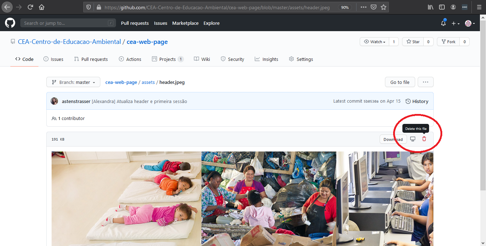

A tela de exclusão exibe duas caixas de texto, no mesmo formato que a
de alteração de arquivo e criação de imagem. As mesmas instruções podem
ser seguidas: colocar uma mensagem que diga o que/porquê está sendo
feito.

Ao contrário da adição de imagens, **excluir uma imagem** faz com que
ela **desapareça do site**, se estiver referenciada nele! Então tome
cuidado de ou excluir no site o código que mostra a imagem ou subir
outra imagem para substituir a primeira, ou o site ficará com erro.

## Colocando alterações no site oficial

Quando o que está no [site de staging] fica pronto para ser colocado no
[site oficial], é necessário juntar o que foi feito de alteração ao que
já está no ar. Isso é válido para alteração de arquivo, imagem nova
subida ou imagem excluída.

ATENÇÃO: TUDO QUE ESTIVER NO [SITE DE STAGING] SUBIRÁ PARA O
[SITE OFICIAL]. Cuidado ao fazer essa operação, para ter certeza que
nada do que está no [site de staging] tem problema estar no
[site oficial].

Para seguir com a atualização, clique em "Pull requests". Um "pull
request" é uma requisição de alteração.

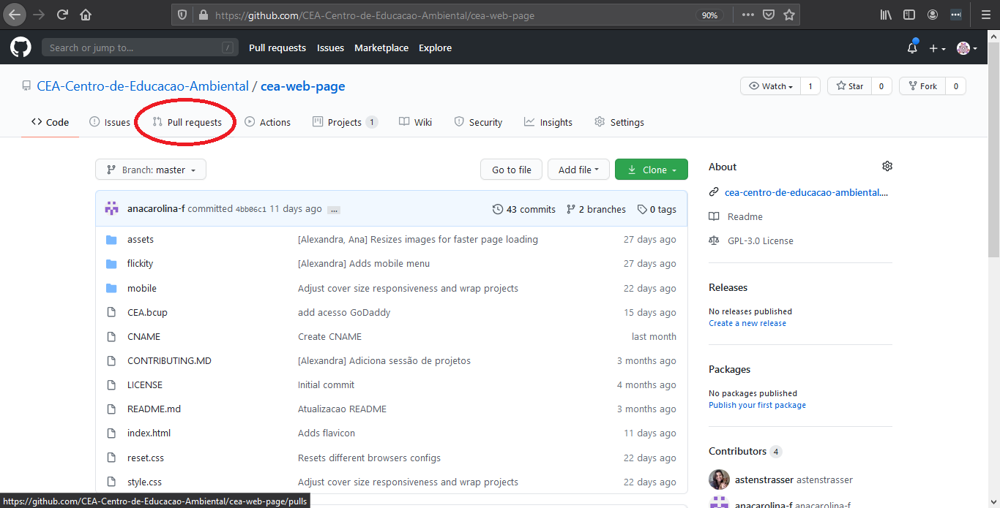

Então, clique em "New pull request".

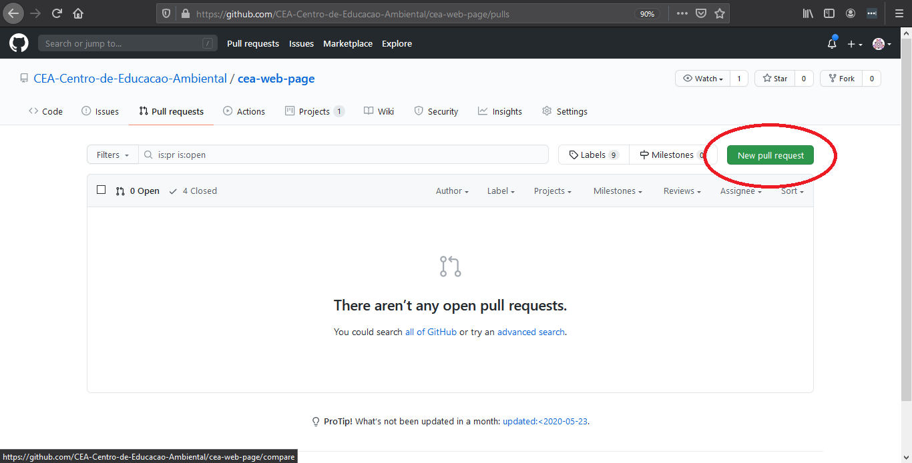

Há dois botões na tela com uma seta no meio. Clique onde se lê
"compare:" e selecione "staging".

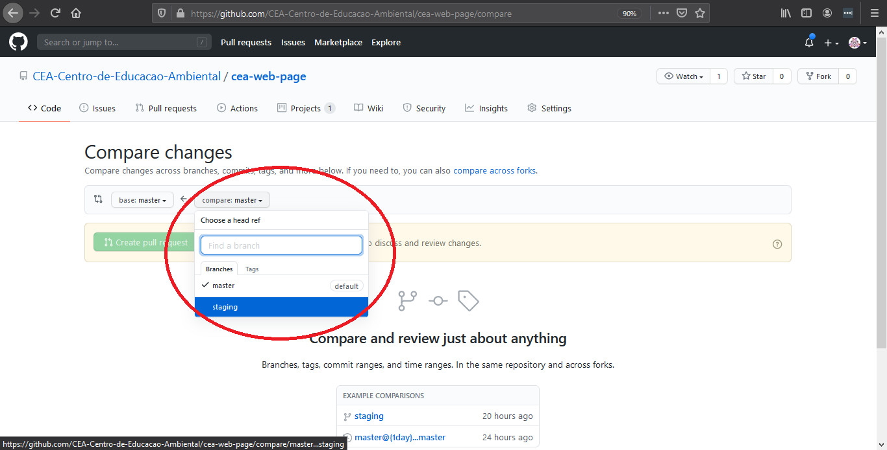

A tela irá mostrar o histórico de alterações, com as mensagens que
foram colocadas quando as alterações aconteceram. Também irá exibir
o conteúdo dos arquivos que foi alterado. Para seguir em frente, clique
em "Create pull request".

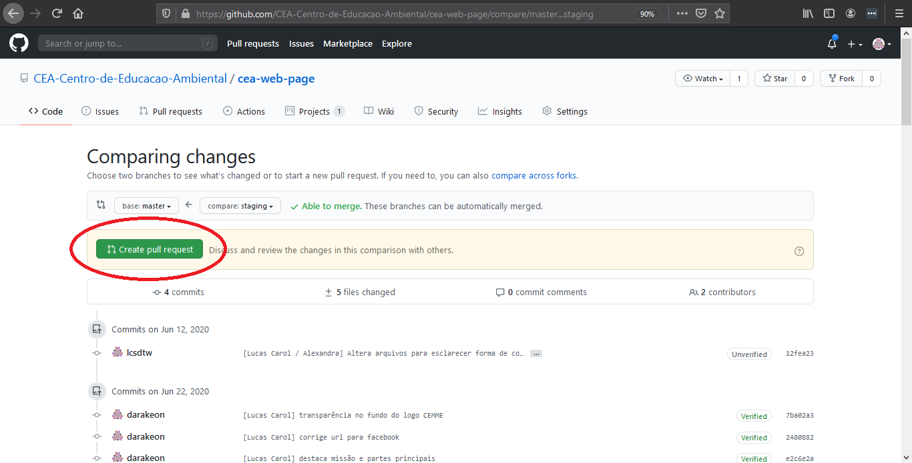

Aparecerá uma tela com caixas de texto. Aqui é possível adicionar
observações sobre as alterações. Pode ser deixado em branco. Para
terminar a criação, clique em "Create pull request" nessa nova tela.

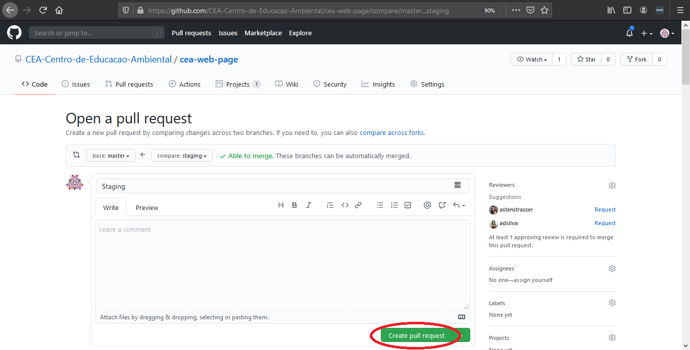

Por segurança, foi configurado para que seja necessário que alguém
aprove a alteração antes de subir. Quando estiver aprovado (ou caso
essa configuração seja desfeita), aparecerá um botão na tela para
colocar as alterações junto com o que já é oficial.

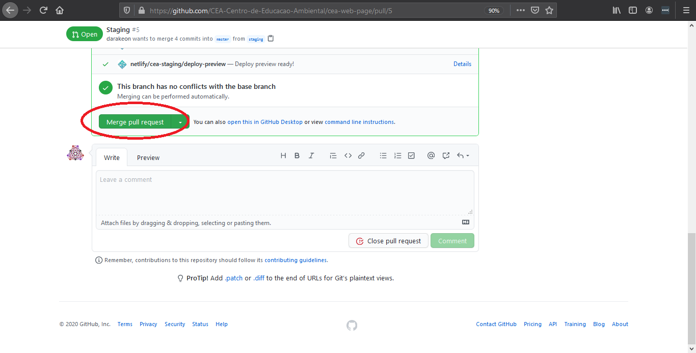

Pouco após o merge, as alterações estarão no [site oficial].

[site de staging]: https://cea-staging.netlify.app/
[site oficial]: https://ceabomjesus.org/
[pull requests]: pulls
